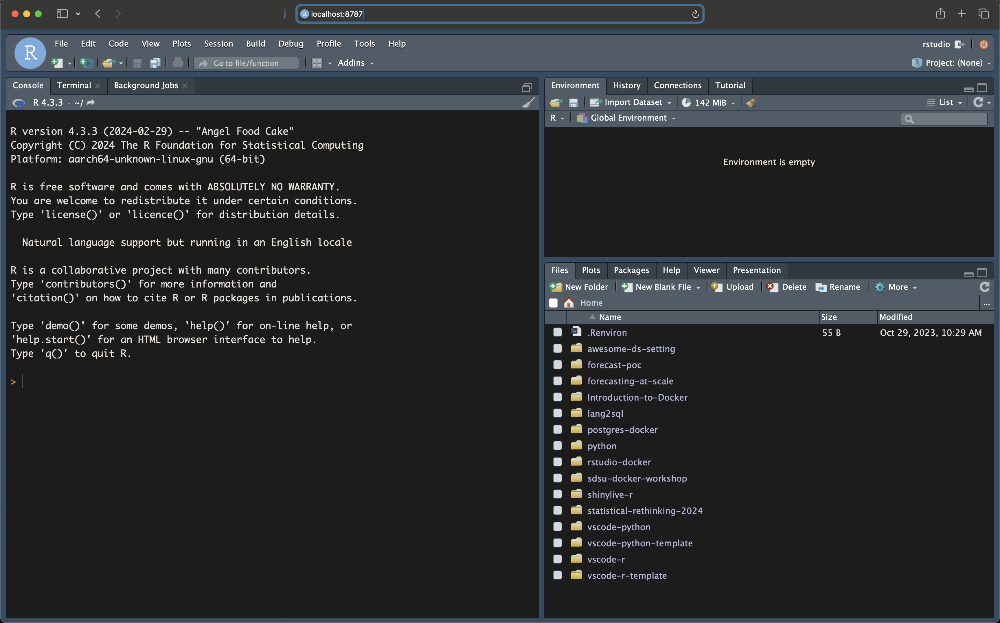

# RStudio Docker Template

🚧WIP 🏗️, pre spell checking🛠️

The repository provides a template for setting a dockerized development environment with Rstudio. The template is based on the Rocker's RStudio image with an additional customization layer.


<br>
<figure>
 </a>
</figure>
</br>


## Settings

This repository has the following structure:

```shell
.
├── README.md
├── docker
│   ├── Dockerfile
│   ├── build_image.sh
│   ├── install_packages.R
│   ├── packages.json
│   └── set_dependencies.sh
└── docker-compose.yml
```

The `docker` folder contains the docker template for adding new packages and the `docker-compose.yml` file has the RStudio container launch settings.


## Launching RStudio with Docker Compose

The `docker-compose.yml` file provides a concise form for the below `docker run` command:


```shell
docker run --rm -ti \
-v .:/home/rstudio \
-v $HOME/.config/rstudio:/home/rstudio/.config/rstudio \
-v $HOME/.Renviron:/home/rstudio/.Renviron \
-e PASSWORD=password \
-p 8787:8787 rocker/rstudio
```

This includes the following functionality:
- Launching the Rocker container - `rocker/rstudio:4.3.2` in an interactive mode
- Mount the local folder to the container home folder
- Mount the local RStudio settings and `.Renviron` file
- Set the login password as a `password`. By default, the login username is `rstudio`
- Map the local port `8787` with the container exposed port - `8787` 


`docker-compose.yml`
``` yaml
version: "3.9"
services:
  rstudio:
    image: "rocker/rstudio:4.3.2"
    ports:
      - "8787:8787"
    volumes:
      - type: "bind"
        source: "."
        target: "/home/rstudio"
      - type: "bind"
        source: "$HOME/.config/rstudio"
        target: "/home/rstudio/.config/rstudio"
      - type: "bind"
        source: "$HOME/.Renviron"
        target: "/home/rstudio/.Renviron"
    environment:
      - PASSWORD=yourpassword
```

**Note:** This docker-compose setting mounts the local folder to the container. You can customize it by modifying the `source` argument under the first `bind` section to the preferred folder path.

## Customize the Image

WIP

## Resources

- Running RStudio Inside a Container - TBD
- RStudio - https://posit.co/products/open-source/rstudio/
- The Rocker Project - https://rocker-project.org/


## License

This template is licensed under a [Creative Commons Attribution-NonCommercial-ShareAlike 4.0 International](https://creativecommons.org/licenses/by-nc-sa/4.0/) License.


